# Creo NC G-POST Companion V2 Blueprint

This is a plan for a minimal engineering companion, written for NC programmers and developers learning the project. Nothing described as future architecture is implemented yet. This phase creates only `README.md` and this document.

**NC** means numerical control: instructions used to operate a CNC machine. A **postprocessor** converts manufacturing instructions from a CAM system into output suited to a machine and controller. **CAM** means computer-aided manufacturing. The Companion assists the engineering work around that postprocessor; the official tools perform their existing jobs.

## 1. Product purpose

The app helps an NC programmer turn machine/controller documentation into reviewed machine information, then into G-POST/OFG configuration guidance, optional custom FIL/CIMFIL logic, and an engineering handoff package.

**OFG** is the Option File Generator, the official configuration tool used in the G-POST workflow. **FIL/CIMFIL** refers here to mechanisms for custom postprocessor behavior; the organization's exact conventions still need research.

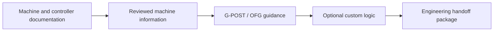

> The app ASSISTS postprocessor development. It does not replace the official postprocessor runtime—the software that executes the postprocessing work.

## 2. The problem

Post development draws on machine manuals, controller manuals, programming manuals, G-POST/OFG documentation, site/shop standards, and engineering knowledge. These sources can leave gaps or disagree.

The app organizes those inputs into a repeatable workflow. It keeps the evidence beside decisions so another programmer can understand what was decided, why, and what remains unresolved.

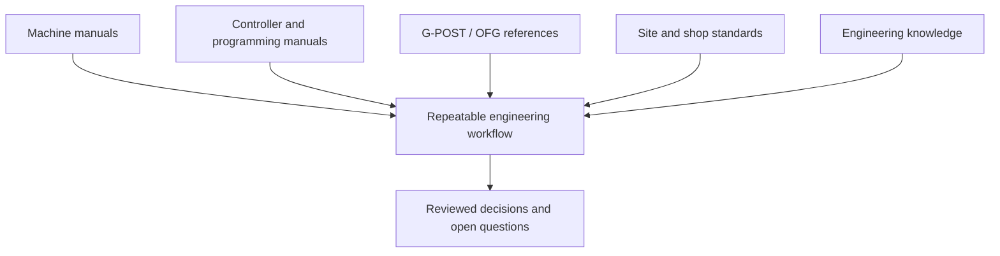

## 3. Non-goals

V2 is not:

- A CAM system.
- A G-code generator. G-code is machine control program text.
- A CL/NCL translator. These are manufacturing instruction data handled by the official workflow.
- A CNC simulator, collision checker, or toolpath viewer. A toolpath is the planned route of a cutting tool.
- A CAD analyzer. CAD means computer-aided design.
- A replacement for Creo, G-POST, OFG, or VERICUT.
- An autonomous AI postprocessor generator.

## 4. Governance boundary

**Governance** means the rules controlling which information may enter a tool, who may approve it, and how decisions are recorded. The application focuses on machine-level engineering information, such as a controller model or a documented spindle limit.

Generative AI must never receive CL, NCL, ACL, APT, production NC/G-code, CAD, STEP, IGES, part geometry, toolpaths, or part-specific manufacturing data. CL/NCL/ACL/APT name manufacturing instruction formats; STEP and IGES are design exchange formats. Their exact formats do not change this prohibition.

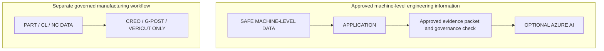

A filename or document category is not proof that its contents are safe. Machine manuals and internal references must be screened for prohibited content before future AI use. The Companion does not need part data to perform its planned work; prohibited inputs should be rejected rather than incorporated into the engineering record.

## 5. The complete user workflow

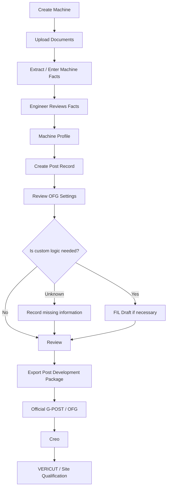

1. **Create Machine.** Identify one physical machine and its controller context. This is the home for its documents, facts, and post development work.
2. **Upload Documents.** Attach allowed manuals and references to that machine. Give each document a useful type and name so its evidence can be found again.
3. **Extract / Enter Machine Facts.** Enter a few important facts manually or use the later deterministic extraction feature. Extracted values start as proposals, not trusted facts.
4. **Engineer Reviews Facts.** Check values, units, and source passages. Confirm supported facts and record questions when evidence is missing or conflicting.
5. **Machine Profile.** See the confirmed facts, proposals awaiting review, and missing required information together. This is the current reviewed understanding of the machine.
6. **Create Post Record.** Open a development effort for a machine-specific postprocessor. The record tracks configuration decisions and the engineering handoff.
7. **Review OFG Settings.** Work through the relevant configuration checklist. Review each suggested value, its explanation, and its verified or unverified OFG location.
8. **Determine whether custom logic is needed.** First ask whether normal OFG configuration handles the requirement. If the answer is unknown, record the information needed to decide.
9. **FIL Draft if necessary.** For a justified custom logic requirement, record a draft with its trigger, evidence, revision, and review state. Drafting does not establish runtime validity.
10. **Review.** Check the profile, OFG decisions, requirements, drafts, and unresolved items. Clearly distinguish reviewed decisions from incomplete work.
11. **Export Post Development Package.** Produce a versioned engineering handoff that records what is known and what still needs attention. An incomplete package must visibly retain its open items.
12. **Official G-POST/OFG.** The NC programmer implements configuration and any appropriate custom logic in the official tools. The Companion does not configure the installed OFG directly.
13. **Creo.** Continue the organization's established Creo manufacturing and posting process with the official postprocessor.
14. **VERICUT.** Use existing governed verification and site qualification processes. A Companion review or export does not prove that machine output is safe or qualified.

> The diagram describes the engineering handoff sequence, not an internal execution diagram of the official products.

## 6. Main navigation

Normal navigation contains exactly four destinations:

```text
┌─────────────────────┐
│ Creo NC             │
│ G-POST Companion    │
├─────────────────────┤
│ Dashboard           │
│ Machines            │
│ Documents           │
│ Post Builder        │
└─────────────────────┘
```

Dashboard identifies the next action. Machines holds machine contexts. Documents organizes their evidence. Post Builder holds post development records.

AI, research tools, analysis, validation labs, toolpaths, historical translation examples, and advanced tooling do not appear in normal navigation. Technical details open inside the relevant record when needed.

## 7. Dashboard

The Dashboard answers: **“What should I work on next?”** Keep it minimal: a compact summary of Machines, Posts in Development, Needs Attention, and Documents; three quick actions; and recent post work below.

```text
┌───────────────────────────────────────────────────────────┐
│ Dashboard                                                 │
│ Machines: 3   Posts in Development: 2                      │
│ Needs Attention: 3   Documents: 8                          │
│                                                           │
│ [Add Machine]  [Upload Document]  [Create Post]             │
│                                                           │
│ Recent Post work                                          │
│ KLS-1840N Post    Review Spindle settings    [Open]         │
│ Mill Post        Resolve controller evidence [Open]        │
└───────────────────────────────────────────────────────────┘
```

Counts are examples. Needs Attention links to specific unresolved work, such as a fact needing review; it is not a complicated health score.

## 8. Machines

A Machine represents one physical CNC machine/controller context. Minimum fields are **Name, Manufacturer, Model, Machine Type, Controller, Notes, and Status (Active / Archived)**. Archiving marks a machine as no longer active while preserving its engineering history.

| Machine tab | Purpose |
| --- | --- |
| Overview | Show identity, notes, status, and an obvious next action. |
| Documents | View evidence sources belonging to this machine. |
| Machine Profile | Review proposed facts, confirmed facts, and information gaps. |
| Posts | Open or create this machine's post development records. |

```text
Machine: KLS-1840N
[Overview] [Documents] [Machine Profile] [Posts]
Manufacturer: …   Model: …   Controller: …
Status: Active
Next action: Review machine facts
```

## 9. Documents

Documents are evidence sources used to learn about a machine/controller. Each document belongs to a machine. The global Documents screen finds documents across machines; the Machine Documents tab shows only that machine's documents.

Initial document types:

- Machine Manual
- Controller Manual
- Programming Manual
- Specification Sheet
- G-POST/OFG Reference
- Approved Internal Reference

Initial accepted formats are **PDF, TXT, and MD**. PDF is a portable document format, TXT is plain text, and MD is Markdown text. A supported file format does not imply every file can be extracted: unreadable or unsupported contents become an open item. Scanned-image recognition is not an initial requirement.

Keep the original source identity and useful page or section locations. An approved internal reference must contain allowed machine-level information, not production programs or part-specific examples.

## 10. Machine Profile

The Machine Profile answers: **“What reviewed facts do we currently trust about this machine?”** The normal screen has three sections and only enough detail to support the next decision.

```text
Machine Profile: KLS-1840N

Needs Review
Maximum Spindle RPM | 2000 RPM | Manual p.42 | [Review]

Confirmed Facts
Controller | FANUC 0i-TF | Engineer Entry | Confirmed

Missing Required Information
Supported Cycles | Needed for Post | [Resolve]
```

These are illustrative values, not specifications for an actual machine. Detailed **provenance**, meaning where a fact came from and how it was reviewed, is available one level deeper. A fact detail view can show the source passage, page, review note, and reviewer without filling the normal screen with technical fields.

Required information depends on the relevant post decisions; the initial required set remains a research question. Changing evidence or a confirmed fact should flag dependent decisions for another review, rather than silently treating the old decision as current.

## 11. Machine Fact

A Machine Fact is one specific statement about a machine. It keeps the value and its evidence together.

| Field | Example |
| --- | --- |
| Canonical Key | `spindle.max_rpm` |
| Label | Maximum Spindle RPM |
| Value | 2000 |
| Unit | RPM |
| Category | Spindle |
| Status | Proposed / Confirmed / Needs Information |
| Source | Machine Manual page 42 |

**RPM** means revolutions per minute. A **canonical key** is a stable internal name: the app can connect `spindle.max_rpm` to an OFG suggestion even if the displayed label changes. It prevents slightly different labels from becoming unrelated fields.

Proposed means awaiting review. Confirmed means an engineer accepted the evidence and value. Needs Information means evidence is missing, ambiguous, or conflicting. Manual entry also requires explicit human confirmation; neither extraction nor AI can confirm a fact automatically.

## 12. Extraction

**Deterministic extraction** uses explicit rules to read known patterns from documents. The same input and rules should produce the same proposed result; extraction does not decide whether that result is engineering truth.

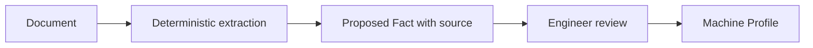

Python is the default future extraction implementation. MATLAB may later be another provider if it proves useful; MATLAB is not required.

```text
ExtractionProvider
├── Python
└── MATLAB — Future / Optional
```

An **ExtractionProvider** is a common agreement for how an extractor accepts document information and returns proposed facts with source locations. This keeps the review workflow the same if a different extractor is added later.

Start with a small candidate set, such as manufacturer, model, controller, and maximum spindle RPM. Confirm usefulness with engineers before expanding. These are candidates, not a settled mandatory schema—a schema is the agreed shape of stored data. Do not build a 100+ field system. If a rule cannot support a value, leave the question open or use manual entry.

## 13. Post Record

A Post Record represents the development effort for one machine-specific postprocessor. Minimum fields are **Name, Machine, Status, Created date, and Updated date**. Dates identify when the record began and last changed.

An initial simple status proposal is Draft, In Review, and Handoff Exported. Handoff Exported describes Companion work only; it does not mean the official postprocessor is qualified. Final status wording can be settled during Post Record implementation.

The workspace has exactly four normal tabs:

```text
Post: KLS-1840N Post
[Overview] [OFG Settings] [FIL / Custom Logic] [Review & Export]
```

Overview identifies progress and the next action. OFG Settings holds configuration guidance. FIL / Custom Logic holds justified requirements and drafts. Review & Export prepares the engineering handoff.

## 14. Post Overview

Overview answers: **“Where does this Post development effort currently stand?”** Show straightforward counts and one next action.

```text
Machine Profile   18 confirmed | 2 missing
OFG Settings      10 reviewed  | 8 remaining
Custom Logic      1 requirement
Open Items        3

Next Action: [Review Spindle settings]
```

These are example counts. An **Open Item** is a specific unresolved question or task attached to the relevant fact, setting, or requirement. It should explain what needs resolution, not add another normal navigation destination. No complicated health scores are needed.

## 15. OFG Settings

This is the **heart of the Post Builder**. It translates reviewed machine/controller engineering information into a checklist of Option File Generator configuration decisions.

The app prepares reviewed configuration guidance. It does **not** directly configure the official installed OFG. The NC programmer applies the decisions in the official tools after checking the applicable documentation and local setup.

Suggested broad categories are:

- Machine & Axes
- File Formats
- Program Start / End
- Motion
- Feedrates
- Tooling
- Spindle
- Coolant
- Cycles
- Machine Codes
- Operator Messages
- Advanced

These are organizing labels for the Companion, not claims about actual OFG tabs. Advanced is a checklist category, not an extra tools menu. Exact OFG paths must be added only after verification against real OFG documentation/screens for the relevant installed version.

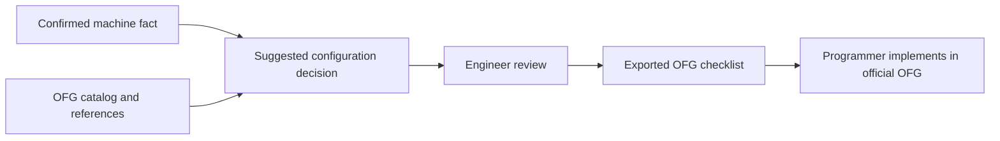

## 16. OFG Catalog

OFG knowledge should be **data-driven**: stored as definitions the app reads, rather than embedded in React screen components. React is a proposed future tool for building the interface; components are reusable pieces of that interface. A catalog is the collection of setting definitions.

The following is a conceptual YAML example. YAML is a readable text format for structured definitions. This example is not a verified OFG setting or location.

```yaml
id: spindle.maximum_speed
label: Maximum Spindle Speed
category: Spindle
applies_to:
  - lathe
  - mill
value_type: number
unit: RPM
machine_fact: spindle.max_rpm
ofg_location:
  category: Spindle
reference_status:
  site_verified: false
```

The ID is a stable setting name. `applies_to` identifies candidate machine types; `value_type` describes an expected kind of value. `machine_fact` links evidence to the decision. The OFG location remains provisional, and `site_verified: false` makes that explicit.

As the team learns the real Creo/G-POST OFG, definitions and references can change without redesigning the frontend. A definition change must still trigger review of affected decisions where appropriate; loading new data does not approve it.

Future conceptual folder only:

```text
ofg/catalog/
├── general.yaml
├── axes.yaml
├── formats.yaml
├── motion.yaml
├── feedrates.yaml
├── tooling.yaml
├── spindle.yaml
├── coolant.yaml
├── cycles.yaml
└── machine_codes.yaml
```

> This is an architecture proposal. These files and folders are not created in this phase.

## 17. One OFG Setting

Every setting should answer four questions: **What is it? What value are we recommending? Why? Where does it belong in OFG?**

```text
Maximum Spindle Speed

Suggested value: 2000 RPM
Why: Use the reviewed machine limit as configuration guidance.
Source: Machine Profile → Maximum Spindle RPM
OFG Area: Spindle (provisional organizing label)
Reference Status: Research Supported / Site Verification Required

[Review decision] [View evidence]
```

This is an illustrative decision, not proof that a matching installed OFG control exists. Research Supported describes reference evidence; Site Verification Required means the installed tool still needs checking. Neither label substitutes for an engineer's review. If the location is not known, display that uncertainty instead of inventing a path.

## 18. Custom Logic

Consider Custom Logic only when normal OFG configuration appears insufficient. A **requirement** describes the behavior needed and its machine-level engineering reason.

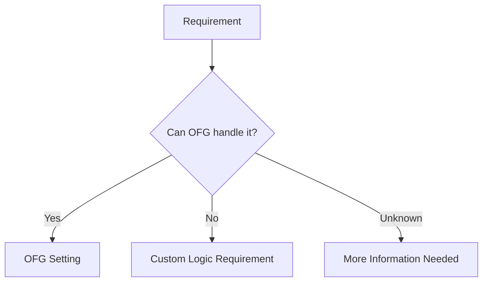

Record the evidence for the decision. An unknown answer stays open for research and human review. FIL is not always needed, and creating a Post Record does not automatically create a FIL Draft.

## 19. FIL / CIMFIL

FIL/CIMFIL is a possible implementation mechanism for behavior beyond standard OFG configuration. Use the term **FIL Draft** throughout the app. Its conventions and permitted use must be checked against official references and organizational practices.

A FIL Draft contains:

- Related requirement: the behavior it is intended to address.
- Trigger: the condition or event that would invoke it.
- Draft code: proposed implementation text.
- Evidence: references supporting the behavior and approach.
- Review status: for example, Draft, Needs Changes, or Reviewed.
- Revision: the draft version being discussed.
- Reviewer: the person responsible for reviewing that revision.

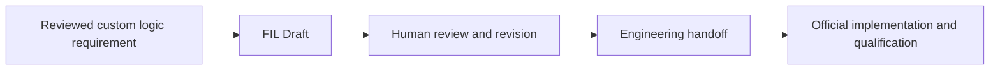

Initially, drafts are entered manually. Later AI scaffolding remains a draft—a starting structure for review. Generated FIL is never automatically valid. A Reviewed status records Companion review; execution, correctness, and qualification remain in the official workflow. No sample FIL application code is created in this planning phase.

## 20. Review & Export

The final screen answers: **“What is complete, what is missing, and what can I hand to the NC programmer?”**

```text
Review & Export
Machine Profile status       Confirmed facts / missing facts
OFG Settings status          Reviewed / remaining decisions
Custom Logic requirements    Resolved / still under investigation
FIL Drafts                   Revisions and review states
Open Items                   Questions requiring follow-up

[Export Post Development Package]
```

The review summary must make unresolved work visible. Export captures a versioned snapshot—an identifiable copy of the decisions and evidence at that time. Later edits do not silently change an already exported package. Export is a handoff action, not official postprocessor approval.

## 21. Post Development Package

Conceptual export only:

```text
KLS-1840N_Post_Development/
├── machine-profile.json
├── machine-profile.md
├── ofg-checklist.csv
├── ofg-checklist.md
├── custom-logic.md
├── fil-drafts/
├── open-items.md
├── sources.json
├── review-summary.md
└── version.json
```

This is an **ENGINEERING HANDOFF PACKAGE**. It is **not a compiled native G-POST postprocessor**. Compiled means transformed into an executable form expected by a runtime; this app does not perform that work.

JSON is a structured data format; CSV is a table stored as text. Markdown files provide readable summaries. The profile files hold reviewed machine information; checklist files hold configuration guidance. Custom logic and draft files record optional work, while open items preserve unresolved questions. Sources identify evidence; the review summary and version identify review state and the exported snapshot.

If there are no custom requirements or drafts, summaries say so and `fil-drafts/` may be empty. The package contains approved machine-level engineering information only, with unresolved work clearly labeled. The exact export assembly is future implementation, not a file structure to create now.

## 22. Official tool boundary

The Companion's responsibility ends at the engineering handoff. Official implementation and qualification belong to the NC programmer and the organization's existing governed tools and processes.

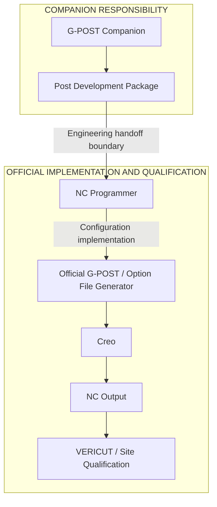

This is a responsibility diagram. It does not assert the internal runtime order of Creo and G-POST. Production NC output remains within the official workflow and is never returned to generative AI through the Companion.

## 23. Future Azure OpenAI

**Azure OpenAI** is a possible future hosted AI service. Azure is not the workflow; it may assist individual engineering tasks after governance and approval conditions are settled. The core workflow must be usable without it.

Potential tasks are explaining an OFG setting, suggesting a mapping between a reviewed Machine Fact and a setting, interpreting allowed machine-level documentation, identifying missing information, classifying requested post behavior, suggesting OFG versus Custom Logic, and drafting FIL/CIMFIL scaffolding after review.

Azure may not read CL/NCL or any other prohibited manufacturing instruction data, read CAD, generate production G-code, simulate machining, or automatically approve Machine Facts, OFG settings, or FIL. All prohibitions in the governance boundary apply, even if a user includes the content in a requirement or draft.

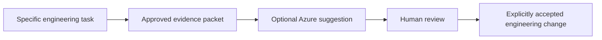

No Azure integration, deployment, model choice, or application module is created now.

## 24. Manus-inspired future workflow

The useful future concept is **Describe Required Behavior**: ask for a specific engineering change, assemble supporting evidence, and propose the smallest relevant object to update. “Manus-inspired” names this interaction idea, not a required platform or implementation dependency.

Example: **“The spindle must stop before turret index.”** Turret index means moving a tool turret to another tool position. This example does not establish how any particular machine or OFG implements the behavior.

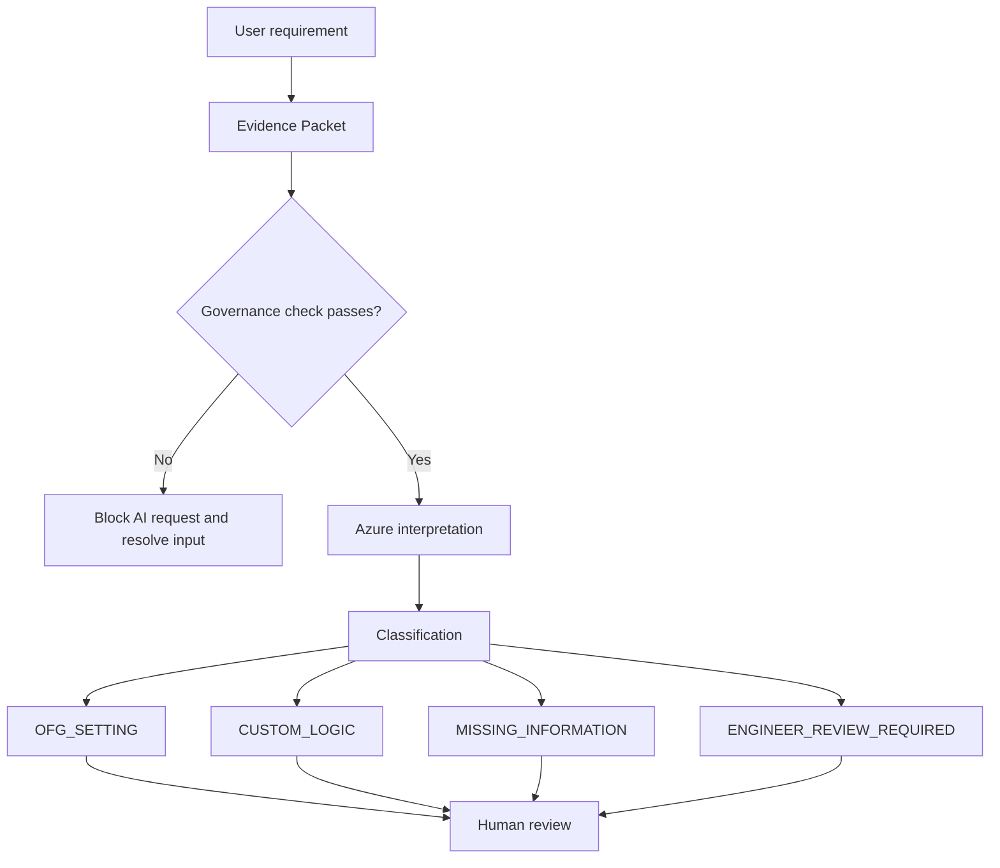

OFG_SETTING suggests a configuration decision. CUSTOM_LOGIC suggests a requirement beyond normal configuration. MISSING_INFORMATION identifies a gap. ENGINEER_REVIEW_REQUIRED leaves a decision with an engineer when the available evidence cannot settle it.

The AI identifies the smallest structured engineering object that should change—a setting, requirement, or open item. It does not generate an entire Post. Its proposed classification cannot silently update trusted data.

## 25. Evidence Packets

An Evidence Packet is the **exact approved information allowed to be sent to future Azure OpenAI**. It is a security/control boundary, not permission to send the whole machine record or all its documents.

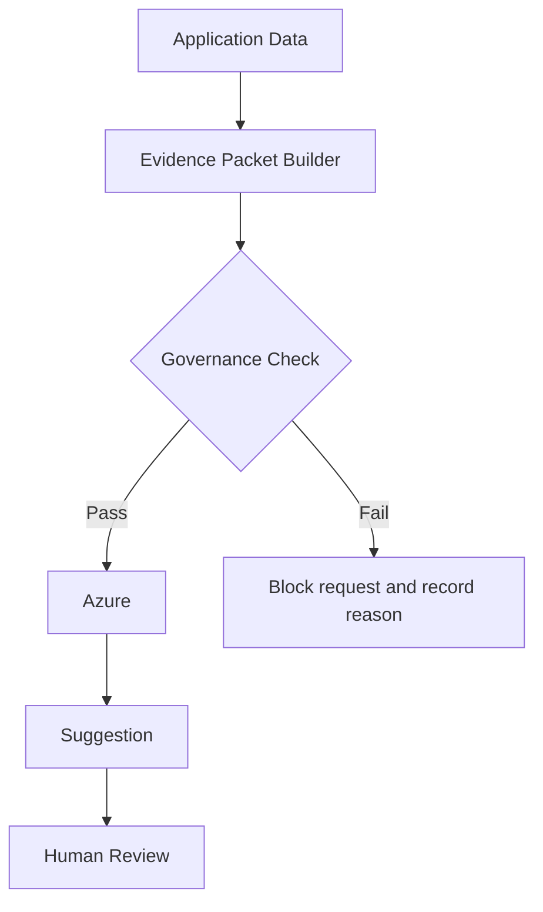

The builder selects only task-relevant, approved machine-level facts, reference excerpts, and the requirement. It preserves source identities and review state so a suggestion can be traced back to evidence. Free text and excerpts require checking too; selecting an allowed field name does not make its contents safe.

Future review records should connect the packet, returned suggestion, and human decision. No packet can contain the prohibited data listed earlier. Governance checks and final approval conditions still need design and research before any Azure implementation.

## 26. Conceptual data model

A **data model** describes what records exist and how they belong together. This is a conceptual plan, not a database being created now.

```text
Machine
├── Machine Documents
├── Machine Facts
└── Post Records
    ├── OFG Settings
    ├── Custom Logic Requirements
    │   └── FIL Drafts
    └── Post Packages

Future only:
Evidence Packets
AI Invocations
```

A machine owns its documents, facts, and post records. Facts refer to their source documents or engineer entries. Each post uses that machine's reviewed profile; OFG decisions link back to facts and catalog definitions. Requirements explain optional custom behavior, drafts belong to requirements, and packages preserve a reviewed handoff snapshot.

The OFG catalog is shared reference knowledge; a Post's OFG Settings are its own decisions based on that knowledge. Open items and review details remain attached to the relevant records. They do not require new normal screens.

An **AI Invocation** is one future request to the AI service and its result. Evidence Packets and AI Invocations would link to the specific task and resulting human decision, rather than become the center of the product.

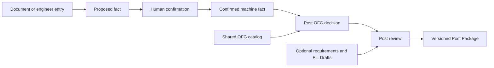

## 27. Future repository structure

The **backend** is the application's data and workflow service. The **frontend** is the interface the programmer sees. An **API**, or application programming interface, is the agreed way the interface requests data or changes from that service. These are future organization choices; no code or folders below are created now.

```text
backend/app/
├── core/
├── machines/
├── documents/
├── extraction/
├── posts/
├── ofg/
├── fil/
├── packages/
└── ai/

frontend/src/
├── app/
├── components/
├── features/
│   ├── dashboard/
│   ├── machines/
│   ├── documents/
│   └── posts/
├── api/
└── types/
```

| Future backend folder | Plain-language responsibility |
| --- | --- |
| `core/` | Shared settings, governance rules, and common behavior. |
| `machines/` | Machine records, facts, and profile review. |
| `documents/` | Allowed document uploads, source information, and retrieval. |
| `extraction/` | The provider agreement and deterministic Python extraction; optional MATLAB later. |
| `posts/` | Post records, progress, and links to the machine's information. |
| `ofg/` | Catalog definitions and reviewed configuration decisions. |
| `fil/` | Custom logic requirements and versioned FIL Drafts. |
| `packages/` | Review summaries and handoff package exports. |
| `ai/` | Later approved evidence packets and optional Azure tasks; deferred until approved. |

| Future frontend folder | Plain-language responsibility |
| --- | --- |
| `app/` | Overall layout and the four normal navigation destinations. |
| `components/` | Small shared interface pieces, such as a review control. |
| `features/dashboard/` | Next actions and recent work. |
| `features/machines/` | Machine tabs and Machine Profile screens. |
| `features/documents/` | Document lists and upload screens. |
| `features/posts/` | The four Post workspace tabs. |
| `api/` | Requests to the backend. |
| `types/` | Agreed descriptions of the data the interface receives. |

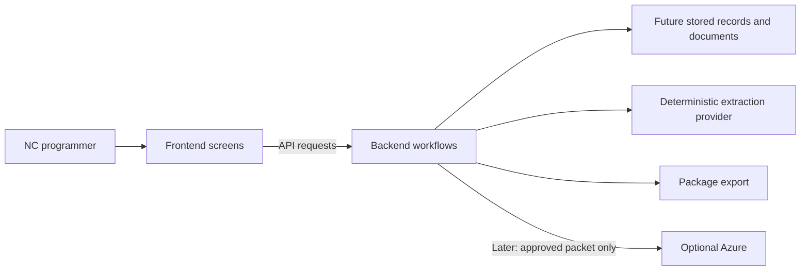

Python/MATLAB extraction lives behind the extraction provider; Azure belongs behind the future evidence-packet boundary. The storage technology and service framework are not selected or installed in this phase.

## 28. What does not belong in V2

Legacy concepts should not return unless separately justified and explicitly scoped:

- CL/G-code translation and translation examples.
- Alignment tools for matching manufacturing data.
- Toolpath viewer and G-code analysis.
- Simulation and collision checking.
- Automatic NC generation.
- Historical AI experimentation pages.
- A large advanced tools menu.
- A generic validation lab.
- CAD/OpenCASCADE processing. OpenCASCADE is a toolkit for working with CAD geometry.

A future justification would need a separate scope decision and must still respect governance. None of these concepts is part of this rebuild plan.

## 29. Sprint plan

A **sprint** is a small, demonstrable block of work. The **MVP**, or minimum viable product, is the smallest usable version of the complete engineering handoff workflow. Each implementation sprint should meet the Definition of Done below.

> This task prepares the plan only. Even Sprint 0 application implementation waits for a separate implementation task.

### Sprint 0 — Foundation

- **Build:** In a later task, establish the agreed repository organization, minimal application shell, common data conventions, governance rules, and automated check setup.
- **Why:** Give subsequent features a clear home and keep the boundaries consistent.
- **Demo:** Open the minimal shell, identify the four planned navigation destinations, and explain where each future feature and its data belong.
- **Not built:** Business features, extraction, catalog content, MATLAB, or Azure. Avoid empty extra tools and unused UI.

### Sprint 1 — Machines

- **Build:** Add, list, edit, and archive machines using the minimum fields.
- **Why:** All evidence and post work need a machine context.
- **Demo:** Add a machine, correct its controller, and archive it while retaining its record.
- **Not built:** CAD, parts, toolpaths, extraction, or postprocessor generation.

### Sprint 2 — Documents

- **Build:** Attach PDF/TXT/MD documents to a machine, choose supported types, and retain source identity with governance-aware input handling.
- **Why:** Make evidence findable before building decisions on it.
- **Demo:** Upload a permitted manual and find it in both Documents and the machine's Documents tab; show an unsupported input being rejected.
- **Not built:** Extraction, scanned-image recognition, unrestricted file ingestion, or AI document analysis.

### Sprint 3 — Manual Machine Profile

- **Build:** Manually enter a small fact set, attach evidence, review facts, and show the three profile sections.
- **Why:** Prove the engineering review workflow without depending on automatic extraction.
- **Demo:** Enter a spindle limit, confirm it with a source, and leave a supported-cycles question unresolved.
- **Not built:** Automatic approval, extraction, or a giant fact schema.

### Sprint 4 — Small Deterministic Extraction

- **Build:** A Python provider using explicit rules for a few agreed fields in supported readable documents; preserve source locations and create Proposed facts.
- **Why:** Reduce repetitive entry while keeping trust with the engineer.
- **Demo:** Extract a candidate value, inspect its source, correct or confirm it, and show that a missing pattern creates no invented fact.
- **Not built:** MATLAB, generative extraction, broad document understanding, or scanned-image recognition.

### Sprint 5 — Post Records

- **Build:** Create machine-linked post records, minimum metadata, the four-tab workspace, and a simple Overview with actionable counts.
- **Why:** Give each development effort a clear place to track work.
- **Demo:** Create a Post Record from a machine and identify its next unresolved profile action.
- **Not built:** Full OFG checklist behavior, custom logic execution, or health scoring. Tabs awaiting later work should state that plainly and add no extra tools.

### Sprint 6 — OFG Catalog Foundation

- **Build:** A small data-driven catalog with stable IDs, applicability, fact links, evidence references, and explicit site-verification status.
- **Why:** Learn and improve OFG knowledge without redesigning screens.
- **Demo:** Inspect a small set of definitions, explain an unverified location, and show how a definition connects to a machine fact.
- **Not built:** A comprehensive catalog, invented exact OFG paths, or direct installed-OFG integration.

### Sprint 7 — OFG Checklist

- **Build:** Relevant per-Post settings, suggestions from confirmed facts, explanations, review states, and remaining work.
- **Why:** Deliver the core engineering configuration workflow.
- **Demo:** Review a spindle suggestion, inspect its evidence and reference status, and see the remaining decision count change. Show that missing evidence remains unresolved.
- **Not built:** Native option-file generation, automatic decision approval, or direct OFG configuration.

### Sprint 8 — Custom Logic Requirements

- **Build:** Record a behavior requirement and the OFG / Custom Logic / More Information Needed decision with evidence.
- **Why:** Keep custom work justified and prefer normal OFG configuration.
- **Demo:** Record a spindle-before-turret requirement and leave its classification open until references support a decision.
- **Not built:** FIL code generation, AI classification, or runtime execution.

### Sprint 9 — Manual FIL Drafts

- **Build:** Manual drafts linked to requirements, triggers, evidence, revisions, reviewer, and review status.
- **Why:** Track justified custom work without implying it is already valid.
- **Demo:** Enter and revise a draft, inspect the related requirement, and record a review on the specific revision.
- **Not built:** Generated FIL, compilation, runtime validation, or automatic approval.

### Sprint 10 — Review & Export

- **Build:** The final review summary and versioned Post Development Package with profile, checklist, optional drafts, sources, and open items.
- **Why:** Complete the Companion's engineering handoff.
- **Demo:** Export a package, read its unresolved items and version, and explain the next official G-POST/OFG step.
- **Not built:** Compiled native posts, production NC output, simulation, or official site qualification.

### Later — MATLAB

- **Build:** An optional extraction provider only if evidence demonstrates enough benefit over Python.
- **Why:** Reuse useful deterministic extraction capabilities without changing the review workflow.
- **Demo:** Compare supported outputs and source traceability for the same document through the provider agreement.
- **Not built:** A mandatory MATLAB dependency, a second review workflow, or part-data analysis.

### Later — Azure OpenAI

- **Build:** Only after approval conditions are resolved, approved evidence packets, governance checks, recorded AI invocations, and a narrowly scoped assistance task.
- **Why:** Help with an individual engineering question while preserving human control.
- **Demo:** Inspect the exact packet, block prohibited content, receive a suggestion, and explicitly accept or reject the proposed change.
- **Not built:** An autonomous Post generator, prohibited-data access, production G-code generation, machining simulation, or automatic approvals.

## 30. Definition of Done

A feature is done only when:

- The user understands why it exists.
- The user can explain where its code lives.
- The user can explain what data it creates.
- The user can manually demo it.
- Automated tests exist: repeatable checks of meaningful behavior, such as review requirements or input boundaries.
- Governance is respected.
- Documentation is updated.
- No unused UI is introduced.

This checklist applies to future implemented features. This documentation-only task is complete when the two requested files are present, the blueprint covers the requested plan, and no application artifacts have been introduced.

## 31. Design principles

- NC programmer first.
- Minimal screens.
- Plain engineering language.
- No unnecessary software jargon.
- No card/dashboard overload.
- No giant tables unless necessary.
- Progressive disclosure for technical details: show them only when the user opens the relevant detail view.
- One obvious next action.
- OFG before FIL.
- Human review before trusted data.
- Evidence before AI recommendation.
- Official Creo/G-POST remains authoritative.

## 32. Open questions

These are **research questions, not implementation requirements**. Unknowns should stay visible rather than become assumed product behavior.

| Research question | What would help answer it? |
| --- | --- |
| What is the exact installed OFG category/tab structure? | Version-specific official documentation and reviewed screenshots from the actual installation. |
| What FIL/CIMFIL conventions does the organization use? | Official references and engineering review of permitted machine-level examples. |
| Which machine facts are truly required for initial OFG configuration? | A small representative machine and its real configuration decisions. |
| Does MATLAB provide enough extraction benefit over Python? | A comparison on approved documents with the same limited field set. |
| What are final Azure approval conditions? | The organization's approved data rules, review process, and allowed service configuration. |
| Which future Azure model/deployment should be used? | Approved tasks, available deployment choices, and evaluation after governance is settled. |
| How may approved internal Post examples be used? | Clear permissions and content screening; approval must not override the prohibited-data boundary. |

## 33. Simple NC programmer demo story

**“We received a new CNC machine.”**

1. **Add the machine.** I enter its identity and controller so the team knows which physical machine this work concerns.
2. **Upload its manuals.** I attach allowed machine and controller references, keeping their source names easy to find.
3. **Enter or extract a few important machine facts.** I start with a small set. Any extracted result is a proposal with a source.
4. **Review them.** I check the evidence, confirm what I trust, and leave unclear information visible as a question.
5. **Create a Post Record.** I give this machine's post development effort a name and a place to track decisions.
6. **Work through relevant OFG settings.** I review suggested values, their reasons, and whether their official OFG locations have been verified.
7. **Record any behavior OFG may not handle.** I document the requirement and first investigate whether normal configuration can satisfy it.
8. **Draft FIL if appropriate.** If custom logic is justified, I record a FIL Draft and its evidence for review. I do not treat it as automatically valid.
9. **Review remaining questions.** I check the missing facts, remaining settings, custom requirements, and draft review states.
10. **Export the engineering package.** I hand off the reviewed decisions, source references, versions, and unresolved items together.
11. **Finish the official Post inside G-POST/OFG.** I implement the engineering decisions using the official tools and applicable organizational conventions.
12. **Test using existing governed Creo and VERICUT processes.** I follow the established qualification process before the postprocessor is used for production.
