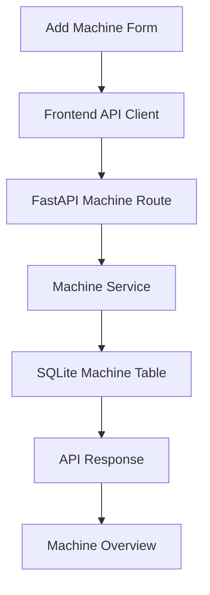

# Sprint 1 — Machines

## Goal

Make Machines the first working area: an NC programmer can add a CNC machine, save it, find it, view and edit its identity, archive it, view archived machines separately, and restore it. Records survive page refresh and backend restart.

## What was built

- The existing Machines page now loads saved records with Active, Archived, and All filters. Active is the default. Each row has an Open link.
- Add Machine saves required identity fields and optional notes, then opens that record's Overview.
- Overview displays identity, status, notes, creation time, and last update time. Edit Machine opens a page using the same form as creation.
- Archive asks for confirmation, retains the record, and changes its status. Restore makes the same record active again. There is no delete action.
- Dashboard shows the number of active saved machines. Its other three counts stay at zero; its approved visual layout is preserved.
- Loading text, inline form validation, understandable service errors, and retry controls support the machine workflow.

The four sidebar destinations and all five Machine tabs remain. Only Overview has real machine data. Documents, Machine Profile, Shop Knowledge, and Posts remain their previous placeholders. The Post workspace is unchanged.

## Machine fields

| Field | Meaning |
| --- | --- |
| `id` | A generated UUID: a unique text identifier that stays the same when edited or archived. |
| `name` | Required Machine Name. |
| `manufacturer` | Required manufacturer. |
| `model` | Required machine model. |
| `machine_type` | Required choice: Lathe, Mill, Mill-Turn, Swiss, or Other. |
| `controller` | Required controller identity. |
| `notes` | Optional plain text; defaults to an empty string. |
| `status` | `ACTIVE` or `ARCHIVED`; defaults to `ACTIVE`. |
| `created_at` | Server-generated creation timestamp in UTC. |
| `updated_at` | Server-generated timestamp for the latest edit/archive/restore. |

UTC is a common time reference. Overview displays dates in the viewer's local browser time. Required fields are trimmed before validation and cannot be empty or whitespace-only. Notes are trimmed too. The frontend validates for convenience; the backend validates independently. Extra incoming fields are rejected.

Creation shows no status selector; a new machine starts Active. Edit updates identity and notes while preserving ID, status, and creation date. Status changes use the separate archive/restore actions.

## Routes

### Browser routes

| Route | Screen |
| --- | --- |
| `/dashboard` | Existing Dashboard with real active-machine count. |
| `/machines` | Saved Machines list and status filters. |
| `/machines/new` | Add Machine. |
| `/machines/:machineId` | Selected machine's five-tab workspace. |
| `/machines/:machineId/edit` | Edit Machine. |

`/machines/demo` is retained solely as a labeled static example for UI inspection. It is not saved, has no edit/archive controls, and does not appear in lists or counts. It is distinct from the acceptance example created through Add Machine. `/posts/demo` is still a placeholder.

### Backend routes

| Method and path | Behavior |
| --- | --- |
| `GET /api/machines` | List all saved machines. |
| `GET /api/machines?status=ACTIVE` | List active machines; `ARCHIVED` lists archived machines. |
| `POST /api/machines` | Create a machine; return its saved record with HTTP 201. |
| `GET /api/machines/{machine_id}` | Read one machine. |
| `PUT /api/machines/{machine_id}` | Replace editable fields; return the updated machine. |
| `POST /api/machines/{machine_id}/archive` | Set status to `ARCHIVED`. |
| `POST /api/machines/{machine_id}/restore` | Set status to `ACTIVE`. |

HTTP is the request/response protocol used by the interface and service. A missing record returns 404; invalid input returns 422; database availability errors return a concise 503 response. The interface does not display stack traces. There is no delete endpoint.

## Backend files

```text
backend/
├── pyproject.toml
├── uv.lock
├── app/
│   ├── main.py
│   ├── core/
│   │   ├── config.py
│   │   └── database.py
│   └── machines/
│       ├── models.py
│       ├── schemas.py
│       ├── service.py
│       └── routes.py
├── migrations/
│   └── 001_create_machines.sql
└── tests/
    └── test_machines.py
```

- `models.py` defines the Machine row and controlled type/status values.
- `schemas.py` defines accepted request fields, returned fields, and validation.
- `routes.py` connects the six Machine API operations to service functions.
- `service.py` performs the parameterized database reads and writes. Parameterized means values are passed separately from SQL instructions.
- `database.py` opens request-specific connections and applies the initial migration at startup.
- `config.py` chooses a stable database file path; changing the working directory does not choose a different default database.
- `main.py` starts FastAPI, connects Machine routes, and returns understandable database/not-found errors.
- `pyproject.toml` lists runtime/test dependencies; `uv.lock` records exact resolved versions for repeatable setup. Empty `__init__.py` files identify Python packages.

No extra repository layer or ORM is used. An ORM is a library that maps objects to database operations; this small slice uses Python's built-in SQLite support directly.

## Frontend files

| File | Purpose |
| --- | --- |
| `src/types/machine.ts` | Machine fields, request types, and controlled machine types. |
| `src/api/client.ts` | Small fetch wrapper with readable errors and field-validation mapping. |
| `src/api/machines.ts` | List/get/create/update/archive/restore requests. |
| `src/features/machines/MachinesPage.tsx` | Real list, filters, loading/error/empty states. |
| `src/features/machines/MachineForm.tsx` | Shared, labeled creation/edit form with validation and saving state. |
| `src/features/machines/AddMachinePage.tsx` | Saves a new machine and opens its Overview. |
| `src/features/machines/EditMachinePage.tsx` | Loads and saves editable fields. |
| `src/features/machines/MachinePage.tsx` | Loads a record and retains the five-tab workspace. |
| `src/features/machines/useMachine.ts` | Small shared record-loading function for detail and edit screens; includes the isolated static UI example. |
| `src/features/machines/tabs/MachineOverviewTab.tsx` | Identity, dates, notes, edit/archive/restore actions. |
| `src/features/dashboard/DashboardPage.tsx` | Loads only the active-machine count. |
| `src/app/router.tsx` | Adds the edit route. |
| `vite.config.ts` | Routes local `/api` requests to FastAPI on port 8010. |

Tests cover shell navigation, machine workflows with a mocked API, and the API client's actual URL/payload/error handling. CSS additions use existing theme tokens; a single error-color token supports readable validation. The other Machine tab files are unchanged.

## Database table and migration

SQLite is a local database stored in one file. The default file is `backend/data/companion.sqlite3`; it is ignored by Git. Startup creates its directory and applies `001_create_machines.sql`. The only application table is **`machines`**, with exactly the eleven Machine fields above. The table also enforces required values and allowed type/status choices.

A migration is a recorded schema change. This first migration runs inside a transaction—a group of database changes that succeed or roll back together. SQLite's built-in `user_version` is set to 1 afterward. Repeated startups skip the applied migration and preserve existing rows. An unsupported schema version fails startup without rewriting the file. No extra migration table, future tables, or audit schema is created.

Set `COMPANION_DB_PATH` before starting the backend to use a different file. Do not delete the default database to restart the app; a normal restart retains all machines. Backend tests use temporary files so they do not modify development records.

## How data flows



1. The form collects identity and notes, trims them, and checks required fields.
2. The frontend API client sends the fields as JSON, a structured text format. During local development, Vite forwards this request to FastAPI.
3. The Machine route validates input again before calling the service.
4. The service assigns an ID and timestamps and commits the record to SQLite.
5. SQLite retains that row on disk after the connection or server closes.
6. The API returns the saved Machine fields; the interface opens the new ID's Overview and loads it from the API.
7. Overview shows persisted values. Edit and archive/restore follow the same path, updating the existing row rather than creating another one.

Refreshing a detail page reloads its ID from SQLite through the API. The active Dashboard count is derived from the active-machine list, not stored as another database field. No future-feature counts are stored.

## Startup and automated checks

From the repository root:

```sh
uv sync --directory backend
uv run --directory backend uvicorn app.main:app --reload --host 127.0.0.1 --port 8010
```

In another terminal:

```sh
cd frontend
npm install
npm run dev
```

Use the frontend URL printed by Vite. It normally uses port 5173 and may choose another port if occupied. Port 8010 is the explicit backend target in `vite.config.ts`; if changing it, change both the startup command and proxy target. No Docker or separate CORS configuration is needed for this local, same-origin proxy workflow. Authentication and production deployment are outside this sprint.

Checks from the root:

```sh
uv run --directory backend pytest
cd frontend
npm test
npm run lint
npm run typecheck
npm run build
```

Backend tests include initialization of a new file, exactly one table, repeat startup, and persisted edited/archive/restored values across application restart. Frontend tests use a mocked Machine API and do not substitute for the real SQLite persistence tests.

## How to manually test

1. Start the frontend and backend as above, and open Dashboard.
2. Click **+ Add Machine**.
3. Enter Machine Name **KLS-1840N Demo**, Manufacturer **KENT**, Model **KLS-1840N**, Machine Type **Lathe**, Controller **FANUC 0i-TF**, and Notes **V2 demo machine**.
4. Click **Create Machine**. Confirm its real Machine Overview opens and the values match.
5. Return to **Machines**. Confirm the machine appears in **Active**.
6. Open it, click **Edit Machine**, change Controller to **FANUC 0i-TF Plus**, and save.
7. Confirm the updated controller appears in Overview. Creation date and ID should be retained.
8. Click **Archive Machine** and cancel once to verify no change occurs. Then archive and accept the confirmation.
9. Return to Machines. Confirm it is absent from **Active**, present in **Archived**, and present in **All**.
10. Open it from Archived and click **Restore Machine**. Confirm it returns to Active.
11. Refresh the browser on its detail route and confirm the same machine and edited controller remain.
12. Stop and restart the backend without deleting the SQLite file, then refresh again. Confirm the record persists.
13. Open Dashboard. Its Machines count should equal active saved records; the other counts remain zero.
14. Try submitting blank or whitespace-only required fields. Confirm inline errors and no saved record. Stop the backend and confirm a useful service error appears rather than a stack trace.

These steps use a real saved machine, not `/machines/demo`.

## Verification results

- Backend: **39 tests passed**, including validation, not-found operations, archive/restore, initial migration, and restart persistence.
- Frontend: **34 tests passed**, including create/edit navigation, filters, confirmation, inline/backend errors, loading states, and API requests.
- Lint, TypeScript checking, and production build: passed.
- The live create → read/list → edit → archive → Archived/All → restore sequence was verified through the actual frontend proxy and SQLite-backed API using the acceptance values above.
- The backend was stopped and restarted against the same default database; the restored record and edited controller were read again successfully. Direct frontend detail/edit route loads returned the application shell.
- A browser was unavailable in the execution session. Mouse-driven browser acceptance and visual inspection were not performed; the manual browser checklist above remains available for inspection. API/restart checks verify persistence; they do not claim a browser refresh was observed.

The acceptance machine is retained in local development storage for inspection. Startup does not recreate or seed it.

## Intentionally not built

Documents or real uploads; Machine Profile facts; Shop Knowledge data; Post creation or management; OFG/FIL logic; parsing/extraction; machine learning; MATLAB; Azure OpenAI; evidence packets; export packages; authentication; hard deletion; extra tables; capability/specification metadata; audit complexity.

## What comes next

Recommended next sprint: **Documents**, scoped separately before implementation. Finish reviewing this Machine workflow first. Do not begin uploads, extraction, or any other future area as part of Sprint 1.

References: [FastAPI testing](https://fastapi.tiangolo.com/tutorial/testing/) and [Python SQLite support](https://docs.python.org/3/library/sqlite3.html).
