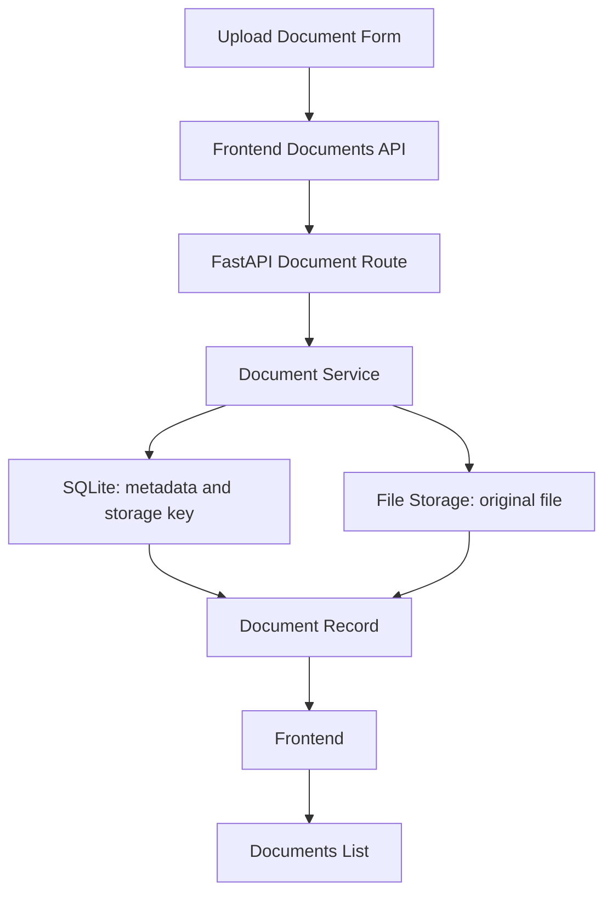

# Sprint 2 — Document Management

## Sprint goal

Let an NC programmer upload a machine-level reference, save its metadata, find it globally and under its Machine, open/download the original, edit its details, archive it, and restore it. Sprint 1 Machine management remains functional. The approved shell and Dashboard layout are preserved.

A Document represents **one original reference file and its descriptive record**. It does not represent extracted knowledge or a Machine Fact.

> Documents are stored in their original form during Sprint 2. OCR/text extraction will be introduced only when deterministic Machine Profile extraction is implemented.

**OCR** means recognizing text in an image. There are no OCR dependencies, scanned-PDF detection, processing services, queues, or processing statuses in this sprint.

## What was built

- Global Documents with Machine, Document Type, and Active/Archived/All filters. Active is the default.
- A labeled upload form requiring a saved Machine, title, document type, and file. Description / Notes is optional. Accepted formats and the configured limit are shown.
- A shared document list inside Machine → Documents, restricted to that Machine. Upload from this tab preselects it.
- Document detail with metadata and actions to open the original, download it, edit details, archive, and restore.
- Metadata editing for title, document type, and description only. A different file requires a new Document.
- Loading, saving/uploading, validation, not-found, service-error, and retry states.
- Dashboard's active-document count and Upload Document quick action. Active-machine counting is retained; Posts in Development and Needs Attention remain zero.

## Machine relationship

Each Document belongs to exactly one saved Machine. A Machine can have many Documents.

```text
Machine
└── Documents
    ├── Document
    ├── Document
    └── Document
```

The database enforces this relationship using `machine_id`, a reference to the Machine's ID. The global table shows the Machine name. The Machine tab omits that column because the context is already known.

An archived Machine can still hold reference documents. Machine archive and Document archive are independent actions: neither silently changes the other's status. The Machine dropdown includes saved active and archived records. The static `/machines/demo` UI example is not saved and cannot receive uploads; use a real Machine created in Sprint 1.

No shared documents, many-to-many relationships, or global/controller/OFG reference libraries are implemented.

## Database fields

| Stored field | Meaning |
| --- | --- |
| `id` | Generated unique Document ID. |
| `machine_id` | The one associated saved Machine. |
| `title` | Required, trimmed document title. |
| `document_type` | Required controlled reference category. |
| `original_filename` | Original base filename for display and download, with supplied directories/control characters removed. |
| `storage_key` | Generated internal filename, such as `UUID.pdf`. |
| `file_type` | `PDF`, `TXT`, or `MD`. |
| `file_size` | Original file size in bytes. |
| `description` | Optional trimmed description/notes, defaulting to empty text. |
| `status` | `ACTIVE` or `ARCHIVED`; new uploads start Active. |
| `created_at` | Server-generated UTC upload time. |
| `updated_at` | Server-generated time of the latest metadata or status change. |

UTC is a shared time reference; the browser displays dates in the viewer's local time. The API also returns `machine_name` by looking up the associated Machine; it is not stored as an extra Document column. Renaming a Machine therefore updates its displayed name in Document views.

Controlled categories and friendly labels:

| Stored value | Display label |
| --- | --- |
| `MACHINE_MANUAL` | Machine Manual |
| `CONTROLLER_MANUAL` | Controller Manual |
| `PROGRAMMING_MANUAL` | Programming Manual |
| `SPECIFICATION_SHEET` | Specification Sheet |
| `GPOST_OFG_REFERENCE` | G-POST / OFG Reference |
| `APPROVED_INTERNAL_REFERENCE` | Approved Internal Reference |
| `OTHER` | Other |

There are no OCR, extraction, AI, embedding, vector, confidence, chunk-count, or Machine Fact fields.

## Metadata versus original file storage

**SQLite stores information ABOUT the document:** title, Machine ID, type, filename, storage key, size, description, status, and dates.

**The filesystem stores the actual PDF/TXT/MD:** original bytes, copied without text extraction or conversion.

```text
backend/data/
├── companion.sqlite3       ← Machine and Document metadata
└── documents/
    ├── generated-id.pdf    ← Original uploaded bytes
    ├── generated-id.txt
    └── generated-id.md
```

Both locations are application-owned local development storage and are ignored by Git. A generated UUID filename avoids collisions between separate uploads named `manual.pdf`. UUID means a unique text identifier; the original name is never used to choose a physical storage path.

Configuration is centralized in `backend/app/core/config.py`:

- `COMPANION_DB_PATH`: optional database-file override.
- `COMPANION_DOCUMENTS_DIR`: optional original-file storage-folder override; otherwise a `documents/` folder beside the database.
- `COMPANION_MAX_UPLOAD_MB`: positive integer upload limit in MB, default **25** (25 × 1024 × 1024 bytes).

The frontend reads the limit and allowed extensions from the backend. Keep the database and original-file folder together when copying local development data; metadata alone does not contain the PDF.

## Database migration

`backend/migrations/002_create_documents.sql` adds only **`documents`**. It does not redesign Machines or create future feature tables. Its `machine_id` relationship prevents removal of a Machine while documents refer to it; there are no normal hard-delete routes.

The existing migration mechanism now applies missing migrations in order. A Sprint 1 database at schema version 1 advances to version 2 while preserving all Machine rows. A new database receives both tables. SQLite's built-in `user_version` tracks the applied version, so no migration tracking table is added. Repeated startups preserve saved records and files.

## Backend files

```text
backend/app/documents/
├── models.py
├── schemas.py
├── service.py
├── routes.py
└── storage.py
```

- `models.py`: the Document row, allowed category/status values, and understandable Document errors.
- `schemas.py`: accepted upload metadata, editable metadata, returned fields, and upload options. A schema is the agreed shape of data.
- `routes.py`: the HTTP endpoints, multipart upload fields, and original-file responses.
- `service.py`: Machine association checks and document database reads/writes.
- `storage.py`: allowed formats, MIME checks, size/non-empty checks, generated filenames, bounded file copying, and safe stored-path lookup.

`core/config.py` holds storage/limit settings. `core/database.py` enables relationship checks and applies migration 002. `main.py` attaches Document routes and readable error handling. `python-multipart` is the only added runtime dependency; it lets FastAPI receive forms containing files. Backend tests are in `backend/tests/test_documents.py`.

## API routes

| Method and path | Purpose |
| --- | --- |
| `GET /api/documents` | List records; optional `machine_id`, `status`, and `document_type` filters can be combined. |
| `GET /api/documents/upload-options` | Return allowed extensions and the configured byte limit for the form. |
| `POST /api/documents` | Upload one file with Machine/title/type/description; return the saved record with HTTP 201. |
| `GET /api/documents/{document_id}` | Read one Document's metadata. |
| `PATCH /api/documents/{document_id}` | Edit title, document type, and/or description. |
| `GET /api/documents/{document_id}/file` | Open the original file inline. |
| `GET /api/documents/{document_id}/file?download=true` | Download the same original, using its safe original filename. |
| `POST /api/documents/{document_id}/archive` | Set status to Archived, retaining the file. |
| `POST /api/documents/{document_id}/restore` | Set status back to Active. |

HTTP is the request/response protocol between the browser and backend. Upload uses multipart form data: metadata fields and a file in one request. Edits use JSON, a structured text format. An empty edit or edits to the file, Machine association, storage key, status, or server dates are rejected.

Missing records return 404, validation errors 422, unsupported formats 415, empty files 400, and oversized files 413. Database/storage failures return a concise 503 message. Original-file errors display plain text in the opened browser tab; metadata errors return structured messages for the interface. No stack traces are shown to the user.

## Frontend files and pages

```text
frontend/src/
├── api/documents.ts
├── types/document.ts
└── features/documents/
    ├── DocumentsPage.tsx
    ├── UploadDocumentPage.tsx
    ├── DocumentDetailPage.tsx
    ├── EditDocumentPage.tsx
    ├── DocumentList.tsx
    ├── DocumentMetadataForm.tsx
    ├── useDocument.ts
    └── format.ts
```

The four pages handle global listing, upload, detail, and edit. `DocumentList` is shared with the Machine Documents tab. `DocumentMetadataForm` shares the title/type/description form fields and save handling. `useDocument` loads the record for detail/edit; `format.ts` formats sizes and dates.

`api/documents.ts` contains small list/get/upload/edit/archive/restore functions and original-file URLs. The shared API client lets the browser set the multipart boundary instead of incorrectly sending a JSON header. `types/document.ts` keeps frontend field names aligned with the backend.

Browser routes are `/documents`, `/documents/upload`, `/documents/:documentId`, and `/documents/:documentId/edit`. Upload from a Machine includes `?machine_id=...` to preselect it. The sidebar stays at four destinations, and Dashboard's visual design is unchanged. Machine Profile, Shop Knowledge, and Posts remain their existing placeholders.

## Upload flow



The diagram shows the two storage destinations. The original-file copy completes before its metadata is committed.

1. Select a saved Machine and enter basic metadata. Choose an allowed file.
2. The frontend checks required fields and configured size/extension limits, then sends the form and original file.
3. FastAPI validates metadata independently; the service confirms the Machine exists.
4. Storage validates the file, copies its original bytes in bounded chunks, and gives it a safe generated key.
5. The service commits metadata and that storage key to SQLite. If the metadata write fails, it attempts to remove the failed upload. Size/format failures also clean up partial files.
6. The returned record opens Document detail and can be found in both global and Machine-specific lists.

SQLite and the filesystem are separate resources, so this is not one shared transaction across both. The small implementation performs immediate cleanup on normal failures; it does not add a job queue or storage reconciliation system. It never creates successful metadata for an upload that fails file validation.

## Viewing and downloading

PDF responses use `application/pdf` with inline disposition so the browser can use its native PDF viewer. TXT and MD are served as plain text, not interpreted as HTML or rendered Markdown. Downloads use attachment disposition. Both actions return the same stored bytes; the app does not build a custom viewer.

A missing physical file returns a readable message while its metadata remains available. An invalid internal key or a symlink pointing outside the storage folder cannot be used to serve another path. Opening a file in a new tab keeps Document detail available.

## Archive behavior

Archive asks for confirmation and changes status to `ARCHIVED`. It does not delete metadata or the original file. Default Active lists omit archived records; Archived and All remain available globally and in a Machine tab. Archived files can still be opened/downloaded. Restore changes the same record back to `ACTIVE`.

Metadata edits do not replace the file. Upload a new Document when another original is needed.

## Governance allowlist and scope boundary

This workflow is for machine-level engineering references. The straightforward extension allowlist is **`.pdf`, `.txt`, `.md`**, case-insensitive. MIME type means the file-format label supplied by the client; compatible types are checked where practical. Unknown/generic client MIME labels are allowed for these extensions, with a PDF header check for PDFs. There is no PDF text parsing or content conversion.

Everything outside the allowlist is rejected, including `.nc`, `.ncl`, `.cl`, `.acl`, `.apt`, `.tap`, `.gcode`, `.cad`, `.step`, `.stp`, `.iges`, `.igs`, and toolpath formats. This excludes manufacturing instructions and design/toolpath data from the reference-upload workflow.

Extension/MIME/header checks do not prove that the contents are appropriate machine-level information. They are a format boundary, not document understanding or AI approval. No content is sent to a generative AI service.

```text
Sprint 2:
File → Upload → Validate → Store original → Associate with Machine
     → Store metadata → View / Download → STOP

Later extraction pipeline:
Stored Document → Text extraction / OCR when required
                → Deterministic extraction → Proposed Machine Facts
                → Human Review → Machine Profile
```

These workflows are separate. Document management adds no Extract, Process, Analyze, Scan, OCR, or Build Profile actions, and no AI controls or processing statuses.

## Startup and manual acceptance test

Use the two-terminal startup instructions in [README](../../README.md). The backend remains at `127.0.0.1:8010`; Vite's `/api` proxy forwards requests there. Open the frontend URL printed by Vite.

Use **a saved Machine**, for example `KLS-1840N Demo` created in Sprint 1. Upload a harmless test PDF with:

- Title: **KLS Machine Manual**
- Type: **Machine Manual**
- Description: **Machine reference manual used for V2 development.**

Then verify:

1. Open Documents and choose Upload Document.
2. Select the saved Machine, enter the metadata, choose the PDF, and upload.
3. Confirm Document detail opens with the correct fields.
4. Return to Documents; confirm the document and correct Machine appear.
5. Open that Machine, then its Documents tab; confirm the same document appears with no repeated Machine column.
6. Open the record, then View / Open File; inspect the original PDF in the browser's viewer.
7. Download it; confirm its original filename and contents.
8. Refresh the browser; confirm the document remains.
9. Edit its title and save; confirm the updated title appears globally and under its Machine.
10. Archive and confirm; check it disappears from Active and remains in Archived/All.
11. Restore it and confirm it returns to Active.
12. Restart the backend without deleting its database/storage; confirm metadata and the original file remain.
13. Check Dashboard counts active Machines and Documents while the two future counts remain zero.
14. Try an unsupported, empty, or oversized file; confirm a useful message and no saved Document.

## Verification results

- **96 backend tests passed:** 57 Document tests plus all 39 Machine tests. Coverage includes PDF/TXT/MD uploads, format/MIME/size/required-field errors, association/filtering, metadata-only edits, archive/restore, original bytes and headers, missing records/files, path safety, failed-upload cleanup, migration from Sprint 1, and restart persistence.
- **60 frontend tests passed:** the original 34 checks plus 26 Document UI/API checks for forms, saved Machine choices/preselection, filters, details, metadata edits, archive/restore, loading/errors, multipart requests, and active-document counting.
- Frontend lint, typecheck, and production build passed.
- Live acceptance checks used the actual frontend proxy, existing saved Machine, SQLite, and a valid one-page test PDF. Upload, both list queries, metadata edit, inline/download response bytes, archive/restore, and direct frontend routes passed.
- The backend was stopped and restarted against the same files. The edited title, Machine association, restored Active status, and exact original PDF bytes remained available. The Machine itself was unchanged by these checks.
- No browser was available in the execution session. Mouse-driven acceptance, native PDF display, and an observed browser refresh were not performed. Live API/restart checks and direct route loading do not substitute for those browser observations; use the checklist above to inspect them.

A test reference document is retained in local development storage for inspection. It is not seeded automatically on startup.

## Intentionally not implemented

OCR, scanned-PDF detection, PDF/text parsing, extraction, embeddings, retrieval-augmented generation (RAG), Machine Profile facts, machine learning, MATLAB, Azure OpenAI, evidence packets, OFG mapping, FIL, Post management, exports, authentication, file replacement, hard deletion, shared/global reference libraries, or extra future tables.

## What comes next

Recommended next sprint: **Manual Machine Profile**, scoped separately. Build manual fact entry and human review before adding deterministic extraction. Sprint 2 stops at managing original references.

References: [FastAPI forms and files](https://fastapi.tiangolo.com/tutorial/request-forms-and-files/) and [Starlette file responses](https://www.starlette.io/responses/#fileresponse).
